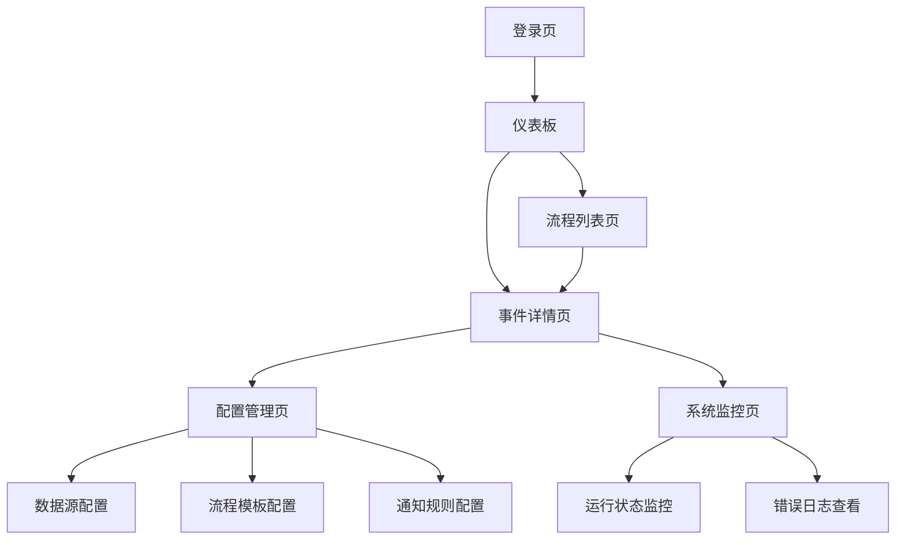

## 1. 产品概述
TrumpSword是一个Meegle智能插件，用于监控和分析美国政治流程。通过自动化收集国会、白宫等官方信息源，智能识别政治事件并触发Meegle中预置的工作流程实例，实现政治进程的实时跟踪和状态更新。

该产品主要服务于政治分析师、媒体记者、政策研究人员等需要实时跟踪美国政治动态的专业用户群体。

## 2. 核心功能

### 2.1 用户角色
| 角色 | 注册方式 | 核心权限 |
|------|----------|----------|
| 政治分析师 | 邮箱注册 | 查看所有政治流程实例、接收实时通知、导出分析报告 |
| 媒体记者 | 邮箱注册+身份验证 | 快速获取事件状态、订阅特定主题流程、生成新闻线索 |
| 政策研究员 | 邀请码注册 | 深度分析历史数据、自定义监控规则、API访问权限 |
| 系统管理员 | 后台创建 | 配置工作流程模板、管理数据源、监控系统状态 |

### 2.2 功能模块
本产品包含以下核心功能模块：
1. **事件收集模块**：从官方信息源自动收集政治事件数据
2. **智能分析模块**：使用LLM对事件进行分类和流程匹配
3. **流程管理模块**：在Meegle中创建和管理政治工作流程实例
4. **状态同步模块**：实时更新流程实例状态
5. **通知推送模块**：向用户发送重要事件提醒

### 2.3 页面详情
| 页面名称 | 模块名称 | 功能描述 |
|----------|----------|----------|
| 仪表板 | 流程概览 | 显示当前活跃的政治流程实例数量、今日新增事件、系统运行状态 |
| 仪表板 | 快速统计 | 展示立法流程、行政命令、人事任命的完成进度统计 |
| 流程列表 | 立法流程 | 列出所有立法相关流程实例，显示当前阶段、进度百分比、预计完成时间 |
| 流程列表 | 行政命令 | 展示行政命令流程实例，包含签署状态、实施进度、司法审查情况 |
| 流程列表 | 人事任命 | 显示人事任命流程实例，跟踪提名、听证会、确认投票等关键节点 |
| 事件详情 | 事件信息 | 展示事件原始数据、来源链接、收集时间、置信度评分 |
| 事件详情 | 流程映射 | 显示事件对应的工作流程模板、当前节点、下一步可能路径 |
| 事件详情 | 历史记录 | 列出该流程实例的所有状态变更历史、操作日志 |
| 配置管理 | 数据源配置 | 管理Congress.gov、WhiteHouse.gov等数据源的API连接设置 |
| 配置管理 | 流程模板 | 配置立法、行政命令、人事任命三类工作流程模板的节点定义 |
| 配置管理 | 用户通知 | 设置不同事件类型的通知规则、接收方式、频率控制 |
| 系统监控 | 运行状态 | 实时监控插件运行状态、API调用成功率、数据处理延迟 |
| 系统监控 | 错误日志 | 记录系统异常、API错误、数据解析失败等问题 |

## 3. 核心流程

### 3.1 事件收集与处理流程
1. **数据收集**：系统定期从Congress.gov、WhiteHouse.gov等官方API获取最新数据
2. **事件识别**：通过关键词匹配和模式识别发现新的政治事件
3. **智能分类**：使用LLM对事件进行分类，判断属于立法、行政命令还是人事任命
4. **流程匹配**：根据事件类型选择对应的Meegle工作流程模板
5. **实例创建**：在Meegle中创建新的流程实例，初始化起始状态

### 3.2 状态更新流程
1. **事件更新检测**：监控已跟踪事件的最新进展
2. **状态分析**：分析事件变化，确定是否需要更新流程状态
3. **节点转换**：调用Meegle API将流程实例从一个节点推进到下一个节点
4. **通知触发**：根据配置向相关用户发送状态更新通知
5. **数据同步**：更新本地数据库中的流程状态信息

### 页面导航流程图

## 4. 用户界面设计

### 4.1 设计风格
- **主色调**：深蓝色(#1E3A8A)体现政治严肃性，辅以白色(#FFFFFF)和浅灰色(#F3F4F6)
- **按钮样式**：采用圆角矩形设计，主要操作为实心蓝色按钮，次要操作为边框按钮
- **字体选择**：使用系统默认无衬线字体，标题16-18px，正文14px，小字12px
- **布局风格**：卡片式布局，顶部导航栏固定，左侧边栏用于模块切换
- **图标风格**：使用简洁的线性图标，符合政府网站的正式感

### 4.2 页面设计概述
| 页面名称 | 模块名称 | UI元素 |
|----------|----------|--------|
| 仪表板 | 流程概览 | 顶部显示三个核心指标卡片，使用大号数字和简洁标签，背景为渐变蓝色 |
| 仪表板 | 快速统计 | 三个饼图展示不同类型流程的完成度，使用蓝、绿、橙三色区分 |
| 流程列表 | 立法流程 | 表格形式展示，包含流程名称、当前阶段、进度条、创建时间，支持筛选和排序 |
| 流程列表 | 行政命令 | 卡片式布局，每张卡片显示命令标题、签署状态、进度百分比 |
| 事件详情 | 事件信息 | 左侧显示事件基础信息，右侧显示来源链接和原始数据预览 |
| 事件详情 | 流程映射 | 流程图形式展示当前节点位置，使用不同颜色标识已完成、进行中、待处理状态 |
| 配置管理 | 数据源配置 | 列表形式展示所有数据源，包含连接状态、最后同步时间、操作按钮 |
| 系统监控 | 运行状态 | 实时监控面板，显示API调用成功率、响应时间、错误率等关键指标 |

### 4.3 响应式设计
采用桌面端优先的设计策略，确保在1920x1080分辨率下的最佳显示效果。同时适配1366x768和2560x1440等常见分辨率。移动端采用自适应布局，关键功能在平板和手机端均可正常使用。

### 4.4 交互优化
- 所有列表页面支持键盘快捷键操作
- 重要操作需要二次确认
- 长时间运行的操作显示进度条
- 错误信息使用友好的提示方式
- 支持批量操作和拖拽排序