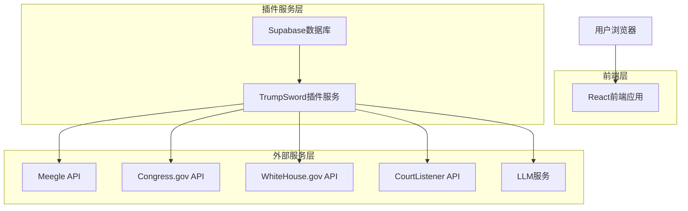
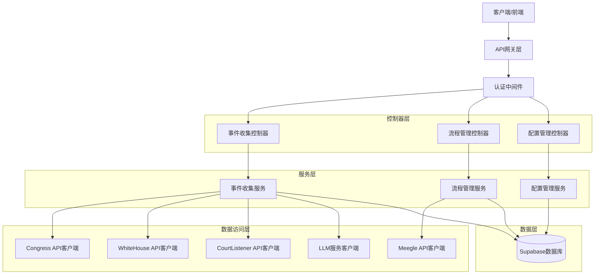
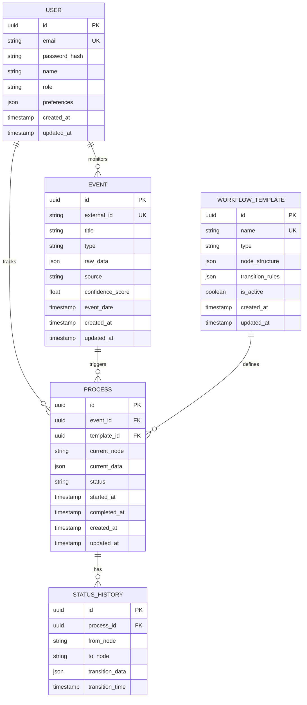

## 1. 架构设计



## 2. 技术描述

- **前端**: React@18 + TypeScript@5 + TailwindCSS@3 + Vite
- **初始化工具**: vite-init
- **后端**: Node.js@20 + Express@4 + TypeScript@5
- **数据库**: Supabase (PostgreSQL)
- **AI服务**: OpenAI GPT-4 API / Claude API
- **外部API**: Congress.gov API, WhiteHouse.gov API, CourtListener API, Meegle API

## 3. 路由定义

| 路由 | 用途 |
|------|------|
| / | 登录页面，用户身份验证 |
| /dashboard | 仪表板，显示系统概览和关键指标 |
| /processes | 流程列表页面，展示所有政治流程实例 |
| /processes/legislative | 立法流程专门页面 |
| /processes/executive | 行政命令流程专门页面 |
| /processes/appointment | 人事任命流程专门页面 |
| /events/:id | 事件详情页面，显示单个事件的详细信息和流程映射 |
| /config | 配置管理页面 |
| /config/data-sources | 数据源配置子页面 |
| /config/workflow-templates | 流程模板配置子页面 |
| /config/notifications | 通知规则配置子页面 |
| /monitoring | 系统监控页面 |
| /monitoring/status | 运行状态监控子页面 |
| /monitoring/logs | 错误日志查看子页面 |

## 4. API定义

### 4.1 核心API

**用户认证相关**
```
POST /api/auth/login
```

请求:
| 参数名 | 参数类型 | 是否必需 | 描述 |
|--------|----------|----------|------|
| email | string | 是 | 用户邮箱地址 |
| password | string | 是 | 用户密码 |

响应:
| 参数名 | 参数类型 | 描述 |
|--------|----------|------|
| token | string | JWT认证令牌 |
| user | object | 用户信息对象 |

**事件收集相关**
```
GET /api/events
```

查询参数:
| 参数名 | 参数类型 | 是否必需 | 描述 |
|--------|----------|----------|------|
| type | string | 否 | 事件类型(legislative/executive/appointment) |
| status | string | 否 | 事件状态 |
| page | number | 否 | 页码，默认为1 |
| limit | number | 否 | 每页数量，默认为20 |

**流程管理相关**
```
POST /api/processes
```

请求:
| 参数名 | 参数类型 | 是否必需 | 描述 |
|--------|----------|----------|------|
| eventId | string | 是 | 关联的事件ID |
| templateType | string | 是 | 流程模板类型 |
| initialData | object | 是 | 初始化数据 |

**状态更新相关**
```
PUT /api/processes/:id/status
```

请求:
| 参数名 | 参数类型 | 是否必需 | 描述 |
|--------|----------|----------|------|
| currentNode | string | 是 | 当前节点名称 |
| nextNode | string | 是 | 下一节点名称 |
| transitionData | object | 是 | 转换相关数据 |

## 5. 服务器架构图



## 6. 数据模型

### 6.1 数据模型定义



### 6.2 数据定义语言

**用户表 (users)**
```sql
-- 创建表
CREATE TABLE users (
    id UUID PRIMARY KEY DEFAULT gen_random_uuid(),
    email VARCHAR(255) UNIQUE NOT NULL,
    password_hash VARCHAR(255) NOT NULL,
    name VARCHAR(100) NOT NULL,
    role VARCHAR(20) DEFAULT 'analyst' CHECK (role IN ('analyst', 'journalist', 'researcher', 'admin')),
    preferences JSONB DEFAULT '{}',
    created_at TIMESTAMP WITH TIME ZONE DEFAULT NOW(),
    updated_at TIMESTAMP WITH TIME ZONE DEFAULT NOW()
);

-- 创建索引
CREATE INDEX idx_users_email ON users(email);
CREATE INDEX idx_users_role ON users(role);
```

**事件表 (events)**
```sql
-- 创建表
CREATE TABLE events (
    id UUID PRIMARY KEY DEFAULT gen_random_uuid(),
    external_id VARCHAR(255) UNIQUE NOT NULL,
    title VARCHAR(500) NOT NULL,
    type VARCHAR(50) NOT NULL CHECK (type IN ('legislative', 'executive', 'appointment')),
    raw_data JSONB NOT NULL,
    source VARCHAR(100) NOT NULL,
    confidence_score FLOAT DEFAULT 0.0,
    event_date TIMESTAMP WITH TIME ZONE,
    created_at TIMESTAMP WITH TIME ZONE DEFAULT NOW(),
    updated_at TIMESTAMP WITH TIME ZONE DEFAULT NOW()
);

-- 创建索引
CREATE INDEX idx_events_type ON events(type);
CREATE INDEX idx_events_source ON events(source);
CREATE INDEX idx_events_event_date ON events(event_date DESC);
CREATE INDEX idx_events_confidence ON events(confidence_score DESC);
```

**工作流程模板表 (workflow_templates)**
```sql
-- 创建表
CREATE TABLE workflow_templates (
    id UUID PRIMARY KEY DEFAULT gen_random_uuid(),
    name VARCHAR(100) UNIQUE NOT NULL,
    type VARCHAR(50) NOT NULL CHECK (type IN ('legislative', 'executive', 'appointment')),
    node_structure JSONB NOT NULL,
    transition_rules JSONB NOT NULL,
    is_active BOOLEAN DEFAULT true,
    created_at TIMESTAMP WITH TIME ZONE DEFAULT NOW(),
    updated_at TIMESTAMP WITH TIME ZONE DEFAULT NOW()
);

-- 创建索引
CREATE INDEX idx_templates_type ON workflow_templates(type);
CREATE INDEX idx_templates_active ON workflow_templates(is_active);
```

**流程实例表 (processes)**
```sql
-- 创建表
CREATE TABLE processes (
    id UUID PRIMARY KEY DEFAULT gen_random_uuid(),
    event_id UUID NOT NULL REFERENCES events(id),
    template_id UUID NOT NULL REFERENCES workflow_templates(id),
    current_node VARCHAR(100) NOT NULL,
    current_data JSONB DEFAULT '{}',
    status VARCHAR(50) DEFAULT 'active' CHECK (status IN ('active', 'completed', 'suspended', 'cancelled')),
    started_at TIMESTAMP WITH TIME ZONE DEFAULT NOW(),
    completed_at TIMESTAMP WITH TIME ZONE,
    created_at TIMESTAMP WITH TIME ZONE DEFAULT NOW(),
    updated_at TIMESTAMP WITH TIME ZONE DEFAULT NOW()
);

-- 创建索引
CREATE INDEX idx_processes_event ON processes(event_id);
CREATE INDEX idx_processes_template ON processes(template_id);
CREATE INDEX idx_processes_status ON processes(status);
CREATE INDEX idx_processes_current_node ON processes(current_node);
```

**状态历史表 (status_history)**
```sql
-- 创建表
CREATE TABLE status_history (
    id UUID PRIMARY KEY DEFAULT gen_random_uuid(),
    process_id UUID NOT NULL REFERENCES processes(id),
    from_node VARCHAR(100),
    to_node VARCHAR(100) NOT NULL,
    transition_data JSONB DEFAULT '{}',
    transition_time TIMESTAMP WITH TIME ZONE DEFAULT NOW()
);

-- 创建索引
CREATE INDEX idx_history_process ON status_history(process_id);
CREATE INDEX idx_history_transition_time ON status_history(transition_time DESC);
```

### 6.3 Supabase访问权限配置

```sql
-- 基本访问权限
GRANT SELECT ON users TO anon;
GRANT SELECT ON events TO anon;
GRANT SELECT ON workflow_templates TO anon;
GRANT SELECT ON processes TO anon;
GRANT SELECT ON status_history TO anon;

-- 认证用户完整权限
GRANT ALL PRIVILEGES ON users TO authenticated;
GRANT ALL PRIVILEGES ON events TO authenticated;
GRANT ALL PRIVILEGES ON workflow_templates TO authenticated;
GRANT ALL PRIVILEGES ON processes TO authenticated;
GRANT ALL PRIVILEGES ON status_history TO authenticated;

-- RLS策略（行级安全）
ALTER TABLE users ENABLE ROW LEVEL SECURITY;
ALTER TABLE events ENABLE ROW LEVEL SECURITY;
ALTER TABLE processes ENABLE ROW LEVEL SECURITY;

-- 用户只能查看自己的数据（除管理员外）
CREATE POLICY users_read_policy ON users FOR SELECT USING (
    auth.uid() = id OR EXISTS (
        SELECT 1 FROM users WHERE id = auth.uid() AND role = 'admin'
    )
);
```