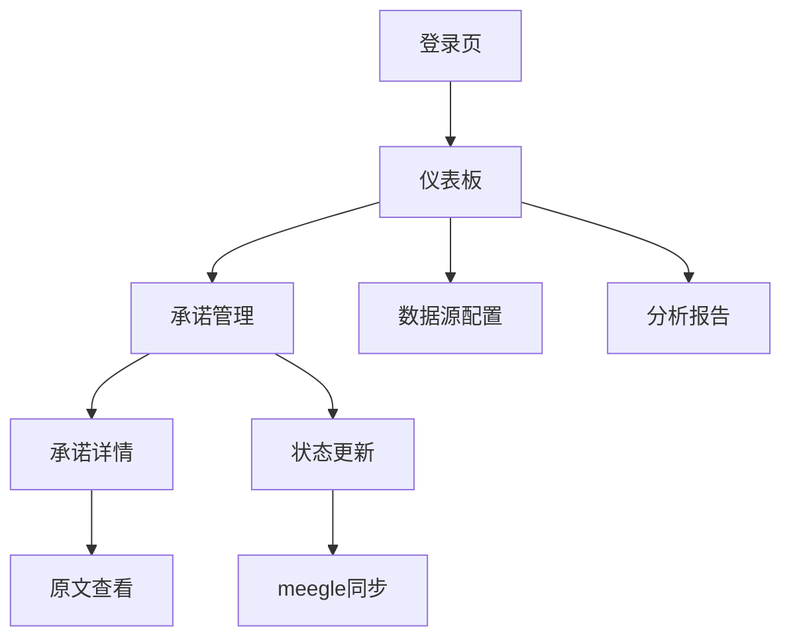

## 1. 产品概述

TrumpSword是一个智能政治承诺追踪系统，自动抓取Donald Trump的言论，提取其政策目标和承诺，并在meegle.com项目管理系统中跟踪实现进度。

该系统帮助政治分析师、记者和公众更好地理解并监督政治领导人的承诺兑现情况，提供数据驱动的政治透明度工具。

## 2. 核心功能

### 2.1 用户角色

| 角色 | 注册方式 | 核心权限 |
|------|----------|----------|
| 系统管理员 | 预配置账户 | 管理数据源、配置抓取规则、审核提取结果 |
| 分析师用户 | 邮箱注册 | 查看承诺列表、更新状态、导出报告 |
| 访客用户 | 无需注册 | 浏览公开承诺和实现状态 |

### 2.2 功能模块

TrumpSword应用包含以下核心页面：
1. **仪表板页面**：数据概览、最新承诺、实现进度统计。
2. **承诺管理页面**：承诺列表、状态更新、详细信息查看。
3. **数据源配置页面**：抓取源管理、规则配置、调度设置。
4. **分析报告页面**：进度报告、趋势分析、导出功能。

### 2.3 页面详情

| 页面名称 | 模块名称 | 功能描述 |
|----------|----------|----------|
| 仪表板页面 | 数据概览 | 显示总承诺数、已实现数、进行中数、逾期数等关键指标 |
| 仪表板页面 | 最新承诺 | 展示最近提取的承诺列表，包含来源和提取时间 |
| 仪表板页面 | 实现进度 | 以图表形式展示承诺实现的整体进度趋势 |
| 承诺管理页面 | 承诺列表 | 展示所有提取的承诺，支持按状态、时间、关键词筛选 |
| 承诺管理页面 | 状态更新 | 手动更新承诺实现状态，添加备注和证据链接 |
| 承诺管理页面 | 详情查看 | 显示承诺原文、提取信息、状态历史等详细信息 |
| 数据源配置页面 | 抓取源管理 | 配置Truth Social、X、新闻稿等数据源URL和参数 |
| 数据源配置页面 | 规则配置 | 设置抓取频率、内容过滤规则、提取提示词 |
| 数据源配置页面 | 调度设置 | 配置自动抓取的时间和频率，支持cron表达式 |
| 分析报告页面 | 进度报告 | 生成承诺实现情况的详细报告 |
| 分析报告页面 | 趋势分析 | 分析承诺类型分布、实现时间趋势等 |
| 分析报告页面 | 导出功能 | 支持导出CSV、JSON格式的数据报告 |

## 3. 核心流程

### 3.1 自动化流程
系统每天自动执行以下流程：
1. 抓取Trump在Truth Social、X、新闻稿中的最新言论
2. 使用LLM分析文本，提取具体的政策承诺和目标
3. 在meegle.com中创建对应的项目任务
4. 标记承诺类型、紧急程度、预期时间线

### 3.2 政治承诺生命周期工作流
每个提取的政治承诺在Meegle中遵循以下标准工作流：

1. **提出 (Proposed)**：初始状态，系统刚提取到承诺
2. **进行中 (In Progress)**：有证据显示正在采取行动（行政命令、法案提出等）
3. **停滞 (Stalled)**：被法院或国会阻止，暂时无法推进
4. **妥协 (Compromise)**：部分实现，与原承诺有差异
5. **实现 (Achieved)**：完全实施或签署成法律
6. **违背 (Broken)**：采取与承诺相反的行动

### 3.3 Meegle集成映射
每个提取的"目标/承诺"映射为Meegle中的一个"工作项"：
- **工作项标题**：承诺摘要
- **工作项描述**：完整原文引用及上下文
- **工作流状态**：从上述生命周期状态映射
- **自定义字段**：承诺类别、来源URL、提取日期、置信度评分

### 3.4 用户操作流程
分析师用户流程：
1. 登录系统查看仪表板概览
2. 浏览最新提取的承诺列表
3. 点击具体承诺查看详细信息
4. 通过web搜索验证承诺实现情况
5. 在系统中更新承诺状态
6. 在meegle.com中同步更新对应任务状态

### 3.3 页面导航流程

## 4. 用户界面设计

### 4.1 设计风格
- **主色调**：深蓝色 (#1e40af) 体现权威性和可信度
- **辅助色**：金色 (#f59e0b) 突出重要信息和特朗普品牌色彩
- **按钮样式**：圆角矩形，悬停效果明显
- **字体**：Inter字体族，标题24-32px，正文14-16px
- **布局风格**：卡片式布局，清晰的信息层级
- **图标风格**：使用Font Awesome图标库，线性图标为主

### 4.2 页面设计概览

| 页面名称 | 模块名称 | UI元素 |
|----------|----------|--------|
| 仪表板页面 | 数据概览 | 使用大号数字卡片展示关键指标，包含进度条和对比图表 |
| 仪表板页面 | 最新承诺 | 时间线样式的卡片列表，显示承诺摘要和来源图标 |
| 仪表板页面 | 实现进度 | 环形进度图和折线图组合，展示历史趋势 |
| 承诺管理页面 | 承诺列表 | 表格形式展示，支持排序和筛选，状态用颜色标签区分 |
| 承诺管理页面 | 状态更新 | 模态框形式，包含状态选择器和富文本备注框 |
| 数据源配置页面 | 抓取源管理 | 卡片网格布局，每个源显示状态指示器和配置按钮 |
| 数据源配置页面 | 规则配置 | 表单分组布局，包含输入框、选择器和开关控件 |
| 分析报告页面 | 进度报告 | 图表组合展示，支持时间段选择和图表类型切换 |

### 4.3 响应式设计
- **桌面优先**：主要面向桌面端用户，优化大屏幕展示效果
- **移动端适配**：支持平板和手机访问，关键功能可用
- **触摸优化**：按钮和交互元素适配触摸操作

### 4.4 数据可视化
- 使用Chart.js或D3.js实现图表展示
- 承诺状态使用颜色编码：已实现(绿色)、进行中(蓝色)、逾期(红色)、待验证(灰色)
- 时间轴展示承诺提取和状态变化历史