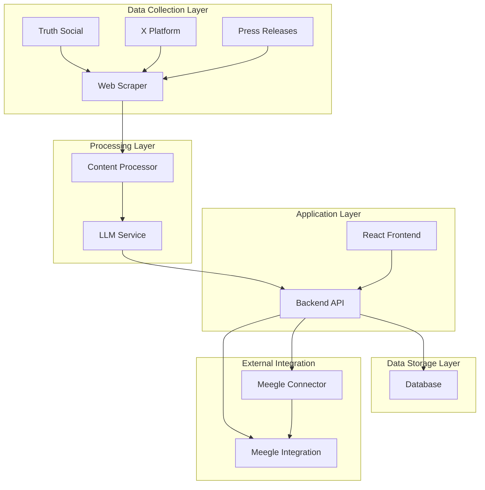
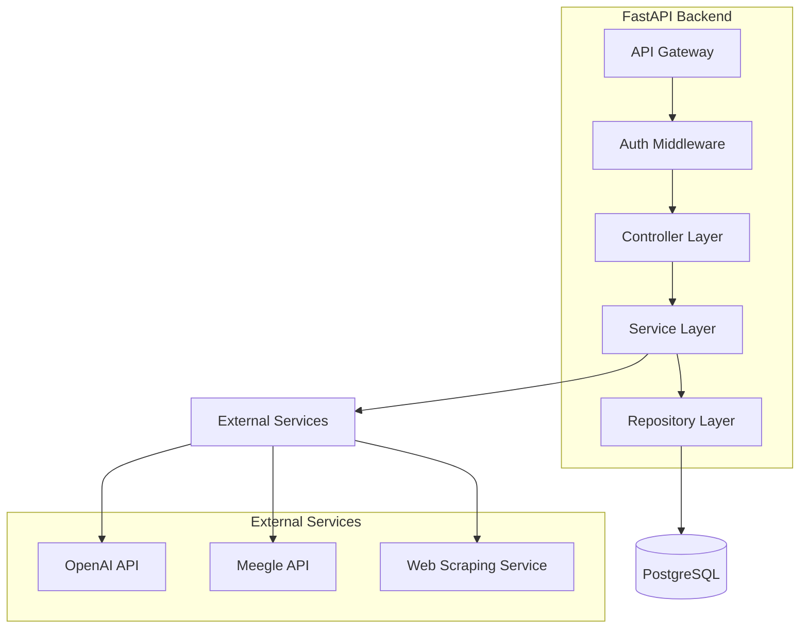
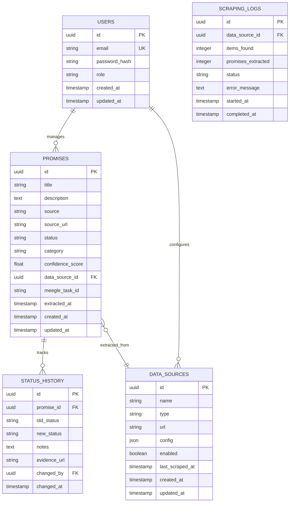

## 1. 架构设计



## 2. 技术描述

- **前端**: React@18 + TypeScript + Tailwind CSS + Vite
- **后端**: Python@3.11 + FastAPI + SQLAlchemy
- **数据库**: PostgreSQL@15 + Redis@7 (缓存)
- **LLM服务**: OpenAI GPT-4 API / Anthropic Claude
- **消息队列**: Celery + Redis
- **容器化**: Docker + Docker Compose
- **初始化工具**: create-react-app (前端), pipenv (后端)

## 3. 路由定义

### 3.1 前端路由
| 路由 | 用途 |
|-------|---------|
| / | 登录页面，用户认证入口 |
| /dashboard | 仪表板页面，显示数据概览 |
| /promises | 承诺管理页面，列表和管理功能 |
| /promises/:id | 承诺详情页面，查看具体信息 |
| /data-sources | 数据源配置页面，管理抓取源 |
| /reports | 分析报告页面，生成和查看报告 |
| /settings | 系统设置页面，用户配置 |

### 3.2 后端API路由
| 路由 | 方法 | 用途 |
|-------|------|---------|
| /api/auth/login | POST | 用户登录认证 |
| /api/auth/logout | POST | 用户登出 |
| /api/promises | GET | 获取承诺列表 |
| /api/promises/:id | GET | 获取单个承诺详情 |
| /api/promises/:id/status | PUT | 更新承诺状态 |
| /api/data-sources | GET/POST | 管理数据源配置 |
| /api/scraping/trigger | POST | 手动触发抓取任务 |
| /api/reports/summary | GET | 获取数据概览报告 |
| /api/meegle/sync | POST | 同步数据到meegle |
| /api/meegle/auth | POST | Meegle OAuth认证 |
| /api/meegle/webhook | POST | 接收Meegle状态变更webhook |

## 4. API定义

### 4.1 认证相关API

**用户登录**
```
POST /api/auth/login
```

请求:
```json
{
  "email": "string",
  "password": "string"
}
```

响应:
```json
{
  "access_token": "string",
  "token_type": "bearer",
  "user": {
    "id": "string",
    "email": "string",
    "role": "string"
  }
}
```

### 4.2 承诺管理API

**获取承诺列表**
```
GET /api/promises?page=1&limit=20&status=all&search=keyword
```

响应:
```json
{
  "items": [
    {
      "id": "string",
      "title": "string",
      "description": "string",
      "source": "string",
      "source_url": "string",
      "extracted_at": "2024-01-01T00:00:00Z",
      "status": "pending|in_progress|completed|overdue",
      "category": "string",
      "confidence_score": 0.95,
      "meegle_task_id": "string"
    }
  ],
  "total": 100,
  "page": 1,
  "limit": 20
}
```

**更新承诺状态**
```
PUT /api/promises/:id/status
```

请求:
```json
{
  "status": "completed",
  "notes": "string",
  "evidence_url": "string",
  "completed_at": "2024-01-01T00:00:00Z"
}
```

### 4.3 数据源配置API

**创建数据源**
```
POST /api/data-sources
```

请求:
```json
{
  "name": "Truth Social",
  "type": "social_media",
  "url": "https://truthsocial.com/@realDonaldTrump",
  "config": {
    "scrape_interval": "0 */6 * * *",
    "max_posts": 50,
    "keywords_filter": ["will", "promise", "guarantee"]
  },
  "enabled": true
}
```

## 5. 服务器架构图



## 6. 数据模型

### 6.1 数据模型定义



### 6.2 数据定义语言

**用户表 (users)**
```sql
CREATE TABLE users (
    id UUID PRIMARY KEY DEFAULT gen_random_uuid(),
    email VARCHAR(255) UNIQUE NOT NULL,
    password_hash VARCHAR(255) NOT NULL,
    role VARCHAR(50) DEFAULT 'analyst' CHECK (role IN ('admin', 'analyst', 'viewer')),
    created_at TIMESTAMP WITH TIME ZONE DEFAULT NOW(),
    updated_at TIMESTAMP WITH TIME ZONE DEFAULT NOW()
);

CREATE INDEX idx_users_email ON users(email);
CREATE INDEX idx_users_role ON users(role);
```

**承诺表 (promises)**
```sql
CREATE TABLE promises (
    id UUID PRIMARY KEY DEFAULT gen_random_uuid(),
    title VARCHAR(500) NOT NULL,
    description TEXT NOT NULL,
    source VARCHAR(100) NOT NULL,
    source_url TEXT,
    status VARCHAR(50) DEFAULT 'pending' CHECK (status IN ('pending', 'in_progress', 'completed', 'overdue', 'failed')),
    category VARCHAR(100),
    confidence_score FLOAT CHECK (confidence_score >= 0 AND confidence_score <= 1),
    data_source_id UUID REFERENCES data_sources(id),
    meegle_task_id VARCHAR(255),
    extracted_at TIMESTAMP WITH TIME ZONE,
    created_at TIMESTAMP WITH TIME ZONE DEFAULT NOW(),
    updated_at TIMESTAMP WITH TIME ZONE DEFAULT NOW()
);

CREATE INDEX idx_promises_status ON promises(status);
CREATE INDEX idx_promises_category ON promises(category);
CREATE INDEX idx_promises_extracted_at ON promises(extracted_at DESC);
```

**数据源表 (data_sources)**
```sql
CREATE TABLE data_sources (
    id UUID PRIMARY KEY DEFAULT gen_random_uuid(),
    name VARCHAR(255) NOT NULL,
    type VARCHAR(100) NOT NULL,
    url TEXT NOT NULL,
    config JSONB DEFAULT '{}',
    enabled BOOLEAN DEFAULT true,
    last_scraped_at TIMESTAMP WITH TIME ZONE,
    created_at TIMESTAMP WITH TIME ZONE DEFAULT NOW(),
    updated_at TIMESTAMP WITH TIME ZONE DEFAULT NOW()
);

CREATE INDEX idx_data_sources_enabled ON data_sources(enabled);
CREATE INDEX idx_data_sources_type ON data_sources(type);
```

### 6.3 Meegle集成设计

Meegle是Lark项目（飞书项目）的国际版本，提供完整的项目管理API。我们将采用以下集成策略：

1. **Meegle OpenAPI**: 使用官方REST API创建工作项
2. **认证机制**: 使用App ID和App Secret进行OAuth认证
3. **状态同步**: 通过webhook实现双向状态同步
4. **工作流映射**: 将政治承诺生命周期映射到Meegle工作流

**Meegle连接器模块**:
- 处理认证和API调用
- 管理工作流状态映射
- 实现重试机制和错误处理
- 记录同步日志和审计信息

**创建工作项API调用**:
```
POST /open_api/:project_key/work_item/create
```

**数据字段映射**:
| Meegle字段 | 承诺数据 | 说明 |
|------------|----------|------|
| Title | promise.title | 承诺摘要 |
| Description | promise.description + 原文上下文 | 完整引用和来源 |
| Workflow State | 映射生命周期状态 | 从政治承诺工作流转换 |
| Priority | confidence_score | 基于置信度计算 |
| Tags | ["trump_promise", "political_tracking", category] | 分类标签 |
| Custom Fields | source_url, extracted_at, category | 扩展信息 |

**政治承诺工作流状态映射**:
```json
{
  "proposed": "待处理",
  "in_progress": "进行中", 
  "stalled": "已阻塞",
  "compromise": "部分完成",
  "achieved": "已完成",
  "broken": "已取消"
}
```

## 7. 抓取和提取策略

### 7.1 数据源配置
- **Truth Social**: 每6小时抓取一次，提取最新50条post
- **X Platform**: 每4小时抓取一次，搜索@realDonaldTrump账号
- **新闻稿**: 每天抓取一次，扫描白宫和竞选网站

### 7.2 LLM提取提示词
```
从以下政治言论中提取具体的政策承诺和目标：

1. 识别明确的承诺性语言（"将"、"承诺"、"保证"、"确保"等）
2. 提取具体的政策内容和实施目标
3. 评估承诺的可衡量性和时间范围
4. 分类承诺类型（经济、移民、外交、教育等）
5. 给出置信度评分（0-1）

输出格式：
{
  "promises": [
    {
      "title": "承诺标题",
      "description": "详细描述",
      "category": "承诺类别",
      "confidence_score": 0.95,
      "timeframe": "预期时间范围"
    }
  ]
}
```

## 8. 部署和监控

### 8.1 容器化部署
- 使用Docker Compose编排所有服务
- PostgreSQL数据持久化存储
- Redis缓存集群配置
- 日志集中收集到文件系统

### 8.2 监控指标
- API响应时间和错误率
- 抓取成功率和提取准确率
- 数据库连接数和查询性能
- meegle同步状态
- LLM API调用成本和延迟